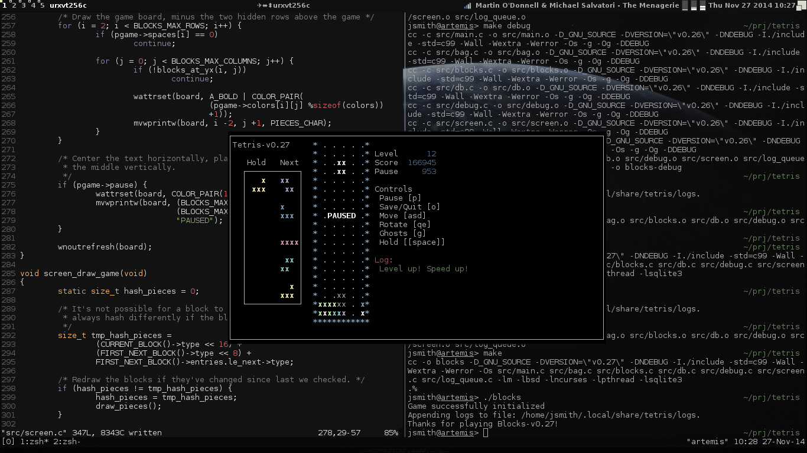

# Tetris

## Building
To pull in dependencies:

    git submodule init
    git submodule update

To build:

    make (or `make debug`)

To install:

    make install (or not)

## Dependencies, Libraries

-GNU C99/POSIX  
-libsqlite3 (3.8+)  
-libncurses  
-libncursesw (ncurses +wide char support)  
-librt  
-libm  

## Contributions

I guess send me code if you want to. As long as it complies to GPL or
BSD/MIT/ISC I'm okay with it.

## License

Copyright (C) 2014 James Smith <james@apertum.org>.  
Read the LICENSE file.

