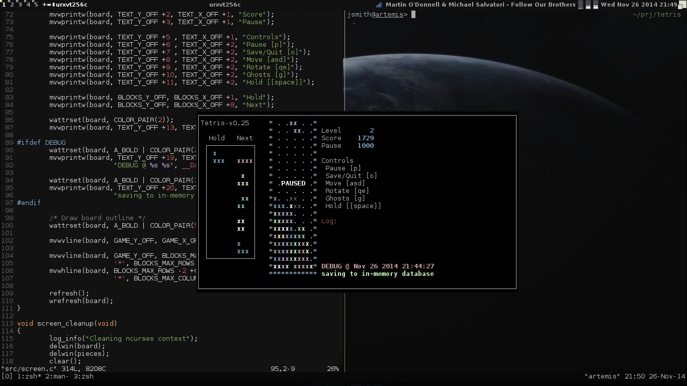
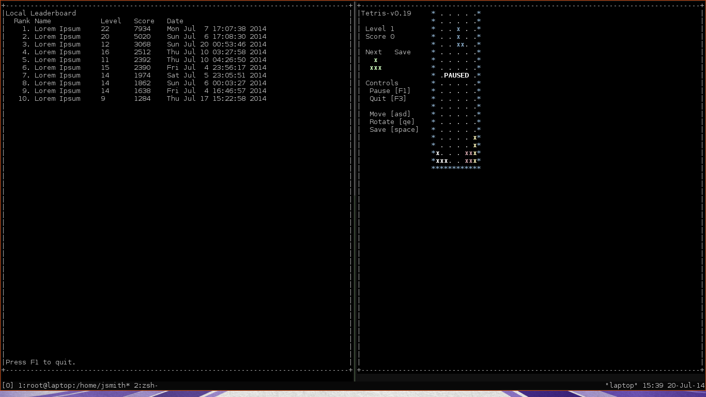

# Falling blocks game

## Building
This program links with sqlite3 (3.8+).
We now also link with libbsd. Specifically for two functions: strlcpy, strlcat.
Any POSIX compliant pthreads implementation should work fine.
I use GCC 4.8.x for building.
Different version may report misc. errors during the build. Patches are welcome

## Contributions
To help with the understanding of this program(it's quite simple), you should
first read the overviews in docs/files/\* to get an idea of what does what.
src/main.c is also a good place to start.

## License
Read the LICENSE file.

